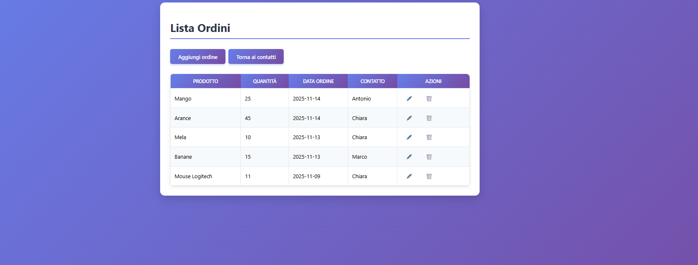
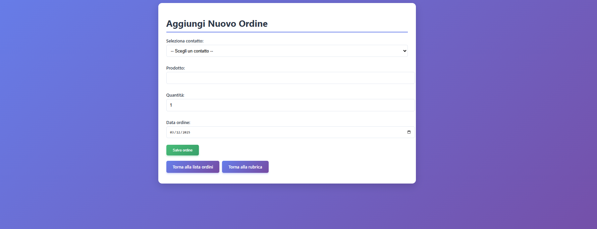
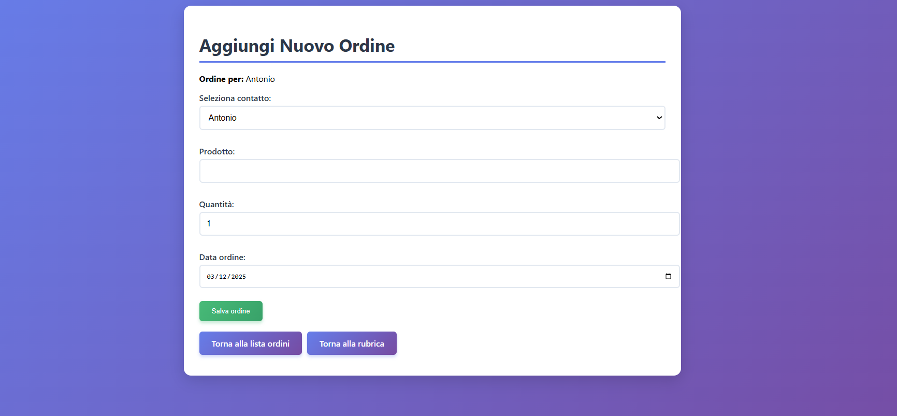
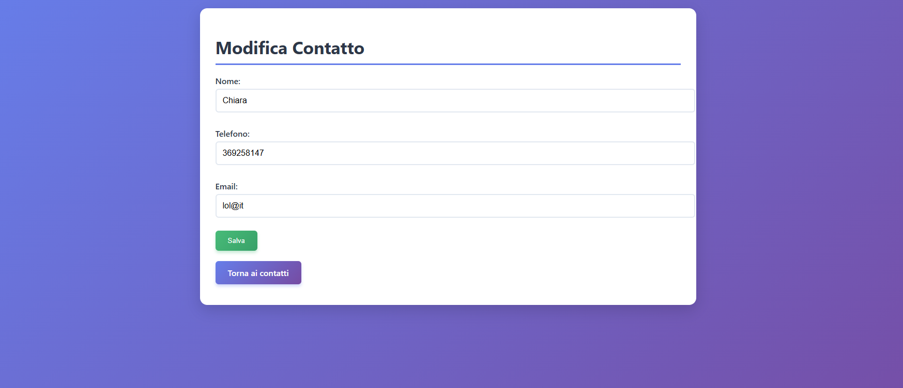

# 🛒 ECOMMERCE – Gestione Contatti e Ordini  

Applicazione web sviluppata in **PHP**, **MySQL** e **CSS** per la gestione di una rubrica clienti e degli ordini ad essi associati.  
Il progetto dimostra competenze full-stack basilari: CRUD, relazioni tra tabelle, validazioni, interfacce intuitive e uso di Prepared Statements.

*Progetto realizzato durante il Corso Full Stack Developer – 2025.*

---

## Funzionalità principali

### Gestione Contatti
- Visualizzazione di tutti i contatti
- Aggiunta nuovo contatto
- Modifica contatto esistente
- Eliminazione contatto
- Icone intuitive per la gestione (🖊️ Modifica, 🗑️ Elimina, 📦 Aggiungi ordine)

###  Gestione Ordini
- Creazione ordini collegati a un contatto
- Validazioni su quantità, date e campi obbligatori
- Modifica e aggiornamento ordini
- Eliminazione ordini
- Lista ordini completa e filtrabile tramite ID contatto

---

## 📸 Screenshot dell’applicazione

   

  

   

 

 

 

---

## Tecnologie utilizzate
- PHP 8 
- MySQL (phpMyAdmin)
- HTML5  
- CSS3 (UI personalizzata) 
- XAMPP (Apache + MySQL)
- Visual Studio Code
- GitHub + Git

--- 

## Autrice Chiara Tanzi 